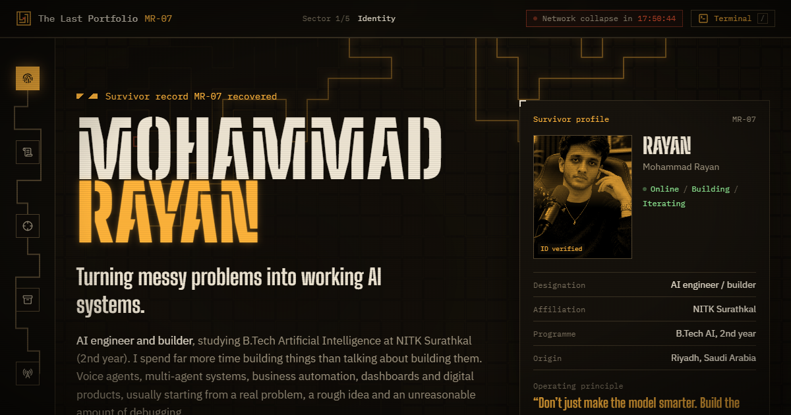

# The Last Portfolio · Mohammad Rayan

**Live: [mohammad-rayan.vercel.app](https://mohammad-rayan.vercel.app/)** · mirror: [mohammed-rayan07.github.io](https://mohammed-rayan07.github.io/)

Silicon Maze 2026, Dev track, Task 2. The Doomsday event has begun and every survivor has one mission: preserve your story. This is mine: the survivor record of an AI engineering student at NITK Surathkal, recovered from an archive node running on emergency power.



## The experience

The site is one route through a maze. You enter at **Identity** and leave at **Final transmission**, and the interface keeps track of where you are:

- **Boot sequence.** The archive powers up, locates record MR-07 and decrypts it. It plays once per session; any key, a click or the skip button dismisses it.
- **A maze that solves itself.** The hero backdrop is a new procedurally generated maze on every visit. A survivor's trail searches it (breadth-first search) and walks the route home carrying a torch, and your cursor is a second torch.
- **Maze-map navigation.** The left rail is a corridor through five sectors that lights up as you scroll. On phones it becomes a bottom bar.
- **Network-collapse countdown.** The HUD counts down to the end of Silicon Maze (18:00 IST, 4 October). After that it reads "Network offline. Archive preserved."
- **Archive terminal.** Press `/` (or tap Terminal) for a working shell: `whoami`, `projects`, `open advocall`, `skills voice`, `goto arsenal`, `contact`, plus tab completion and history.
- **Classified record files.** Every project opens as a full file with a gallery, the problem, what it does, how it works, proof and stack. Records have shareable links (`#archives/jarvis`), and you can move between them with the arrow keys.
- **Arsenal ↔ Archives.** Select any skill to see which records it was used in, then filter the archives by it. Field-use pips show how many projects used each tool instead of made-up percentage bars.

## Rubric map

| Task | Where it lives |
| --- | --- |
| **1.1 Identity** | Hero: name, designation, B.Tech AI at NITK (2nd year), introduction, areas of interest, survivor ID card |
| **1.2 Survivor's log** | Transit record (Riyadh → NITK), personal story, education and coursework, crews (IET NITK, Team AlgoHunters, Raynix AI), off-duty (powerlifting), dated log entries, the three layers I build across, field record (₹10,000 Farmer Income Prediction Challenge win), current objective and long-term mission |
| **2.1 Skill archive** | 35 tools in 6 categories: Languages, AI and ML, Voice AI, Automation and integrations, Web and data, Shipping and product |
| **2.2 Arsenal interface** | Icon rows, field-use pips, a sticky trace readout, click-to-trace into the projects |
| **3.1 Project records** | 8 records, each with a name, description, technologies, a real screenshot or diagram, and source or live links (or a note when the source is private) |
| **3.2 Presentation** | Featured record, filter toolbar, full record files with galleries, incident log, proof stats, previous/next navigation |
| **4.1 Interface** | Amber-phosphor archive identity, Big Shoulders + IBM Plex type system, consistent housings, smooth sector navigation, motion that answers actions |
| **4.2 Responsive** | Tested at 320, 375, 768, 1024, 1200, 1280, 1440 and 1920 px with no horizontal overflow; bottom navigation on mobile |
| **5.1 Contact** | Final transmission: email (with copy), LinkedIn, GitHub, and a composer that opens your email app |
| **5.2 Deployment** | Vercel production at [mohammad-rayan.vercel.app](https://mohammad-rayan.vercel.app/), mirrored on GitHub Pages (`gh-pages` branch, `npm run deploy`) |

Accessibility: everything reachable by keyboard, visible focus, dialogs that take focus and close with Esc (record files also trap focus), a skip link, `prefers-reduced-motion` respected (static maze, no decode or boot animation), and alt text on every image.

## Projects in the archive

| Code | Project | Context |
| --- | --- | --- |
| JRV-01 | [J.A.R.V.I.S. × Doomsday](https://github.com/Mohammed-Rayan07/jarvis-doomsday): voice command centre for real Calendar, Drive and Telegram | Silicon Maze 2026 |
| ADV-02 | [Advocall](https://github.com/Mohammed-Rayan07/advocall): AI advocate that calls customer care for you | Build for Billions 2026, lead engineer |
| RAY-03 | [Raynix MedLog Agent Suite](https://github.com/Mohammed-Rayan07/raynix-medlog-suite): 8 agents for medical logistics, AR + EN | Raynix AI |
| VXD-04 | Roadside Recovery Voice Dispatcher: the voice agent I broke on purpose | Raynix AI (private) |
| RCI-05 | [Refund Claim Integrity Engine](https://github.com/Mohammed-Rayan07/refund-claim-integrity) | Razorpay AI Buildathon 2026 |
| STK-06 | [StockPilot](https://github.com/Mohammed-Rayan07/stockpilot): inventory where the last unit can't sell twice | [Live demo](https://stockpilot-ten-beryl.vercel.app) |
| AYA-07 | Ayah Archive: a digital-product business, end to end | [ayaharchive.shop](https://ayaharchive.shop) |
| LIN-08 | [Linear Regression from Scratch](https://github.com/Mohammed-Rayan07/linear-regression-from-scratch) | Self-study |

## Stack

React 19 · TypeScript · Vite · Tailwind CSS 4 · Motion · Canvas 2D (maze) · simple-icons · lucide-react. Static build, no backend, no tracking.

## Run it locally

```bash
npm install
npm run dev      # http://localhost:5173
npm run build    # type-check and build to dist/
npm run deploy   # build and publish dist/ to the gh-pages branch
npx vercel deploy --prod   # publish to Vercel production
```

Every fact on the site lives in [`src/data/content.ts`](src/data/content.ts). Edit that file to update the portfolio.

```
src/
  data/content.ts        all content: identity, log, arsenal, projects
  lib/maze.ts            maze generation (recursive backtracker) and BFS solver
  lib/hooks.ts           active sector, media queries, safe storage
  components/
    Boot.tsx             first-visit boot sequence
    Hud.tsx              top bar, countdown, progress
    MazeNav.tsx          maze-map rail (desktop) / bottom bar (mobile)
    MazeCanvas.tsx       hero maze, BFS trail and torches
    Hero.tsx             identity and survivor ID card
    SurvivorLog.tsx      about: story, dossier, log entries, field record
    Arsenal.tsx          skills with trace-to-project
    Archives.tsx         record cards and filters
    RecordFile.tsx       full project dialog
    Terminal.tsx         archive terminal
    Transmission.tsx     contact and footer
```

---

Built by Mohammad Rayan for Silicon Maze 2026 (Web Enthusiasts' Club, NITK).
